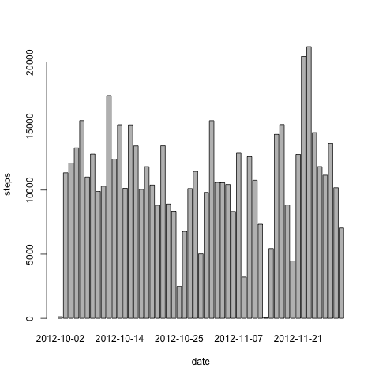
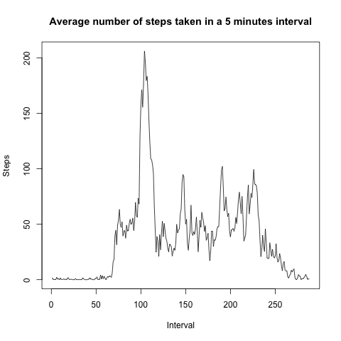
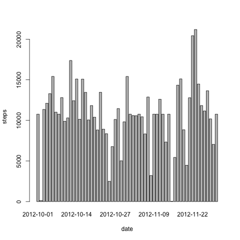
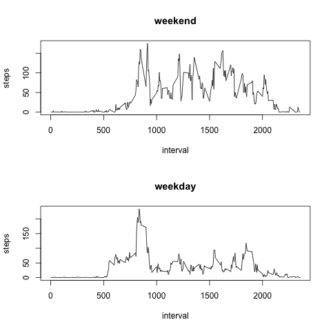

Peer Assessment nº1 - Reproducible Research
========================================================
by Javier Martínez Arribas

## Loading and preprocessing the data

**Load the data: [Activity monitoring data](https://d396qusza40orc.cloudfront.
                                            net/repdata%2Fdata%2Factivity.zip)**

For the first step of the assessment we need:
* Get the url where we can find the data
* Download the data, in this case data are in a .zip file
* Unzip the file in the selected destiny
* Load the data in a dataframe
* No need to preprocess the data fro our final purpose

```r
orig <- getwd()
orig <- paste(orig,sep="","/activity.csv")
model <- read.csv(orig,header=T)
```


## What is mean total number of steps taken per day?


**Make a histogram of the total number of steps taken each day**
   
  

```r
library(data.table)
DT <- data.table(model)
steps_date <- na.omit(DT[,sum(steps),by=date])
barplot(steps_date$V1,names.arg=steps_date$date,xlab="date",ylab="steps")
```

 
  

**Calculate and report the mean and median total number of steps taken per day**
  
 
  

```r
mean(steps_date$V1)
```

```
## [1] 10766
```

```r
median(steps_date$V1)
```

```
## [1] 10765
```


## What is the average daily activity pattern?


**Make a time series plot (i.e. type = "l") of the 5-minute interval (x-axis) 
and the average number of steps taken, averaged across all days (y-axis)**

  

```r
mean_steps_per_interval <- tapply(model$steps,model$interval,mean,na.rm=T)

ts.plot(mean_steps_per_interval,ylab="Steps",
      xlab="Interval",main="Average number of steps taken in a 5 minutes interval")
```

 


**Which 5-minute interval, on average across all the days in the dataset, 
contains the maximum number of steps?**
  
  

```r
m_steps <- tapply(model$steps,model$interval,mean,na.rm=T)

m_steps[which(m_steps==max(m_steps))]
```

```
##   835 
## 206.2
```


## Imputing missing values


**Calculate and report the total number of missing values in the dataset 
(i.e. the total number of rows with NAs)**

 

```r
sum(is.na(model))
```

```
## [1] 2304
```


**Devise a strategy for filling in all of the missing values in the dataset. 
The strategy does not need to be sophisticated. For example, you could use 
the mean/median for that day, or the mean for that 5-minute interval, etc.**

  I use the mean of each interval to refill the missing values in it.

```r
model_refilled <- model
mean.int <- tapply(model$steps,model$interval,mean,na.rm=T)
inter <- as.numeric(levels(factor(model$interval)))
mean.int <- as.data.frame(cbind(inter,mean.int))
colnames(mean.int) <- c("interval","means")
```


**Create a new dataset that is equal to the original dataset but with the 
missing data filled in**
  
  I make a loop to create the new dataset with the missing values refilled.

```r
for(i in 1:nrow(model)){
   if(is.na(model[i,1])){
      interval <- model[i,3] 
      media <- mean.int[which(mean.int[,1]==interval),2]
      model_refilled[i,1] <- media 
  }
}  
```


**Make a histogram of the total number of steps taken each day and calculate 
and report the mean and median total number of steps taken per day. 
Do these values differ from the estimates from the first part of the assignment? 
What is the impact of imputing missing data on the estimates of the total 
daily number of steps?**

  We observe a more simmetric distribution although with some kurtosis and 
  big tails, making more probably extreme values than in a more normal distribution.
  

```r
library(data.table)
DT <- data.table(model_refilled)
steps_date <- na.omit(DT[,sum(steps),by=date])
barplot(steps_date$V1,names.arg=steps_date$date,xlab="date",ylab="steps")
```

 


## Are there differences in activity patterns between weekdays and weekends?


**Create a new factor variable in the dataset with two levels – “weekday” 
and “weekend” indicating whether a given date is a weekday or weekend day**

  Weekend days are "sábado" and "domingo" as 
  "saturday" and "sunday" in english spoken countries.
  

```r
days <- factor(weekdays(as.Date(model[,2])))
days <- as.character(days)
for(i in 1:length(days)){
  
  if(days[i]=="sábado" | days[i]=="domingo"){
   
    days[i] <- "weekend"
  }
  else{
    days[i] <- "weekday"
  }
  
}
```


**Make a panel plot containing a time series plot (i.e. type = "l") of the 
5-minute interval (x-axis) and the average number of steps taken, averaged 
across all weekday days or weekend days (y-axis). The plot should look something
like the following, which was creating using simulated data:**

  

```r
par(mfrow=c(2,1))
for (type in c("weekend", "weekday")) {
    steps.type <- aggregate(steps ~ interval,
                            data=model,
                            subset=days==type,
                            FUN=mean)
    plot(steps.type, type="l", main=type)
}
```

 

